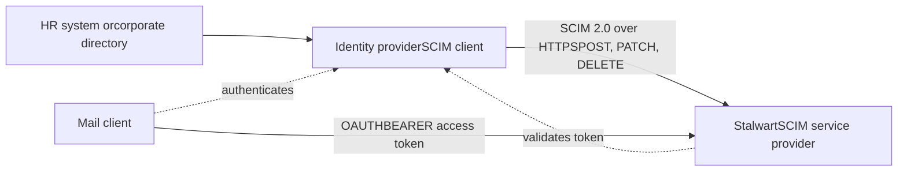

---

## title: "Overview｜概述"

 title\_original: "Overview"
source: "[https://stalw.art/docs/auth/scim](https://stalw.art/docs/auth/scim)"
chapter: \["docs","auth","scim"\]
order: 94
lang: "bilingual"
translated\_by: "google\_v2+gtx"
mermaid: "1/1 原始碼"
captured: "2026-10-05T01:05:02.171Z"

 ⬆ 目錄　｜　⬅ 上一篇：Individual｜個人　｜　下一篇：Configuration｜配置 ➡

# Overview｜概述

> 章節：\\\[docs｜文件\\\]\\\(&lt;000 目錄.md#c-2&gt;\\\) › \\\[auth｜認證\\\]\\\(&lt;000 目錄.md#c-3&gt;\\\) › \\\[scim｜方案\\\]\\\(&lt;000 目錄.md#c-10&gt;\\\)

SCIM, the System for Cross-domain Identity Management, is the standard by which an identity provider pushes account lifecycle changes into the applications it governs. When a new employee is created in the corporate directory, SCIM creates the corresponding mail account. When the employee changes department, SCIM updates the group memberships. When the employee leaves, SCIM suspends the account and, if the policy calls for it, deletes it. The protocol is defined by [RFC 7643](https://www.rfc-editor.org/rfc/rfc7643) \(core schema\) and [RFC 7644](https://www.rfc-editor.org/rfc/rfc7644) \(protocol\), with the motivation set out in [RFC 7642](https://www.rfc-editor.org/rfc/rfc7642).

 SCIM（跨域身分識別管理系統）是身分識別提供者將帳戶生命週期變更推送至其所管理應用程式的標準。當在公司目錄中建立新員工時，SCIM 會建立相應的郵件帳戶。當員工調換部門時，SCIM 會更新其組員身分。當員工離職時，SCIM 會暫停該帳戶，並根據策略要求將其刪除。該協議由 [RFC 7643](https://www.rfc-editor.org/rfc/rfc7643) （核心模式）和 [RFC 7644](https://www.rfc-editor.org/rfc/rfc7644) （協議）定義，其動機在 [RFC 7642](https://www.rfc-editor.org/rfc/rfc7642)中闡述。

 Stalwart implements the **service provider** half of the protocol: it receives provisioning requests and applies them to its own account store. It never acts as a SCIM client, so there is no outbound provisioning to other systems, no event feed, and no delivery queue to operate. The whole feature is request and response over the existing HTTP listener, rooted at `/scim/v2`.

 Stalwart 實作了協定的**服務提供者**部分：它接收配置請求並將其應用到自身的帳戶儲存中。它從不充當SCIM客戶端，因此不會向其他系統發出出站配置請求，也沒有事件流和交付隊列需要操作。整個功能都是透過現有的HTTP監聽器（根於`/scim/v2`進行請求和回應。

 This feature is available exclusively in the Enterprise Edition of Stalwart and is not included in the Community Edition. Requests to `/scim/v2` on a Community Edition server are rejected with `403 Forbidden`.

 此功能僅在 Stalwart 的 企業版中可用，社群版不包含此功能。對社群版伺服器上的`/scim/v2`請求將被拒絕，並回傳`403 Forbidden` 。

## Roles in the deployment｜部署中的角色

The identity provider is the SCIM client and the source of truth for identities. Microsoft Entra ID, Okta, Keycloak, and any other conforming implementation can fill that role. Stalwart is the target, and it holds mailboxes, not identities.

 身分提供者是SCIM客戶端，也是身分資訊的權威來源。 Microsoft Entra ID 、Okta、Keycloak 以及任何其他符合標準的實作都可以扮演這一角色。 Stalwart 是目標伺服器，它儲存的是郵箱，而不是身分資訊。

 The pairing this design assumes is **SCIM together with OpenID Connect**, not SCIM together with LDAP or SQL. The identity provider owns authentication, so users sign in against it and Stalwart validates the resulting access token. The identity provider also owns the account lifecycle, pushed ahead of first login through SCIM. The account therefore exists before anybody signs in, and it stops working the moment the identity provider says so.

 此設計假定的組合是 **SCIM與 OpenID Connect**，而非SCIM與LDAP或SQL組合。身分提供者負責身份驗證，因此使用者透過其進行登錄，Stalwart 會驗證產生的存取權杖。身分提供者也負責帳戶生命週期，該生命週期透過SCIM在首次登入之前啟動。因此，帳戶在任何人登入之前就已經存在，並在身分提供者終止其工作狀態時立即停止。

 No credential ever crosses the SCIM interface. The published service provider configuration advertises `changePassword` as unsupported and the `password` attribute is absent from the published User schema, because in this topology there is no password for a provisioning client to set. Credentials remain with the identity provider throughout.

 任何憑證都不會經過SCIM介面。已發布的服務提供者配置聲明`changePassword`不受支持，且已發布的 User 架構中缺少`password`屬性，因為在此拓撲中，配置客戶端無需設定密碼。憑證始終保留在身分提供者處。

## Gaps in just-in-time provisioning｜即時供應方面的差距

 Without SCIM, an OIDC-backed domain relies on just-in-time provisioning: the account is created the first time its owner successfully authenticates. Neither gap can be configured away.

 如果沒有SCIM ，由OIDC支援的網域將依賴即時設定：帳戶將在其擁有者首次成功進行身份驗證時建立。這兩個缺陷都無法透過配置來消除。

 No mailbox exists before first login. A new hire cannot receive mail until they have personally signed in at least once, so messages sent during onboarding are rejected because the address does not resolve to a local recipient. SCIM closes the gap by creating the account at the moment the identity is created in the corporate directory, which is typically days before the first sign-in.

 首次登入前不存在郵箱。新員工必須至少親自登入一次才能接收郵件，因此在入職期間發送的郵件會被拒絕，因為該地址無法解析為本機收件者。 SCIM 透過在公司目錄中建立身分時建立帳戶來縮小差距，這通常是在首次登入前幾天。

 Just-in-time provisioning also never removes anything. It has no way to learn that an account has been deleted upstream, so a departed employee’s mailbox persists indefinitely and continues to accept mail. SCIM closes that gap in two ways: `PATCH` with `{"active": false}` suspends the account immediately while retaining its contents, and `DELETE` removes it outright.

 即時配置也永遠不會刪除任何內容。它無法獲知上游帳戶已被刪除，因此離職員工的郵箱會無限期保留並繼續接受郵件。 SCIM 透過兩種方式縮小這一差距：`PATCH` 和 `{"active": false}` 立即暫停帳戶，同時保留其內容，而 `DELETE` 將其徹底刪除。

 A full comparison of the two models, including which one to choose for a given deployment, is given in Provisioning models.

 配置模型中給出了兩種模型的完整比較，包括針對給定部署選擇哪種模型。

## Scope｜範圍

 Stalwart provisions two resource types. **Users**map onto individual accounts with their primary address, aliases, display name, locale, time zone, and administrative status.**Groups** map onto group accounts and their membership. Both carry an `externalId`, the identifier the identity provider uses for its own records, which is indexed and filterable so that a client can find a resource it provisioned earlier without storing Stalwart’s identifiers.

 Stalwart 提供兩種資源類型。 **使用者**對應到包含其主要地址、別名、顯示名稱、語言環境、時區和管理權限的個人帳戶。**群組**對應到群組帳戶及其成員。兩者都帶有`externalId` ，這是身份提供者用於其自身記錄的標識符，該標識符已被索引並可過濾，以便客戶端無需存儲 Stalwart 的標識符即可找到先前配置的資源。

 Beyond the two resource types, the server publishes the discovery endpoints every client probes on connection \(`/ServiceProviderConfig`, `/ResourceTypes`, and `/Schemas`\), supports bulk operations and query-by-POST, and honours entity tags for optimistic concurrency. The full endpoint list and the limits that apply to each are documented in Endpoints and protocol support.

 除了兩種資源類型之外，伺服器還會發布每個客戶端在連接時探測到的發現端點（ `/ServiceProviderConfig`, `/ResourceTypes`和`/Schemas` ），支援批量操作和按POST查詢，並支援實體標籤以實現樂觀並發。完整的端點清單以及適用於每個端點的限制記錄在 端點和協定支援中。

 Stalwart follows the [SCIM interoperability profile](https://datatracker.ietf.org/doc/draft-zollner-scim-interop-profile/), which removes the freedoms in RFC 7644 that cause clients and servers to disagree, in everything except its rule that undefined attributes must be rejected; see why undefined attributes are accepted for the reasoning, and schema handling for what `interopProfileConformant` reports as a result. It also implements the lifecycle requirements of the [IPSIE profile](https://datatracker.ietf.org/doc/draft-schreiber-scim-ipsie-profile/) and cursor-based pagination from [RFC 9865](https://www.rfc-editor.org/rfc/rfc9865).

 Stalwart 遵循 [SCIM互通性規範](https://datatracker.ietf.org/doc/draft-zollner-scim-interop-profile/) ，該規範移除了RFC 7644 中導致客戶端和伺服器不一致的自由度，但未定義屬性必須被拒絕此規則除外；有關原因，請參閱 \[接受未定義屬性的原因\([https://stalw.art/docs/auth/scim/provisioning#why-undefined-attributes-are-accepted](https://stalw.art/docs/auth/scim/provisioning#why-undefined-attributes-are-accepted)\) `interopProfileConformant` ，。 模式處理 。它也實現了 [IPSIE規範](https://datatracker.ietf.org/doc/draft-schreiber-scim-ipsie-profile/)的生命週期要求以及 [RFC 9865](https://www.rfc-editor.org/rfc/rfc9865)中的基於遊標的分頁。

## Getting started｜入門

 Setting up SCIM involves three decisions on the Stalwart side and one integration on the identity provider side:

 設定SCIM需要在Stalwart方面做出三個決定，並在身分提供者方面進行一個整合：

- Which domains the identity provider is allowed to provision, controlled by allowScimProvisioning on each Domain.
身份提供者可以配置哪些域，由每個 Domain上的 allowScimProvisioning控制。
- Which account the SCIM client authenticates as, and the API key it presents as a bearer token.
SCIM客戶端以哪個帳戶進行身份驗證，以及它作為持有者令牌提供的 API金鑰 。
- Which permissions that account holds, starting with `scimAccess`.
該帳戶擁有的權限，從`scimAccess`開始。
These are covered in Configuration. The attribute-by-attribute translation between SCIM resources and Stalwart accounts is documented in Attribute mapping, and the procedures for individual identity providers are collected under Identity providers.
 這些都在配置中有介紹。 SCIM 資源和 Stalwart 帳戶之間的逐屬性轉換記錄在屬性映射中，並且各個身份提供者的過程收集在身份提供者下。

 ---

 ⬆ 目錄　｜　⬅ 上一篇：Individual｜個人　｜　下一篇：Configuration｜配置 ➡
