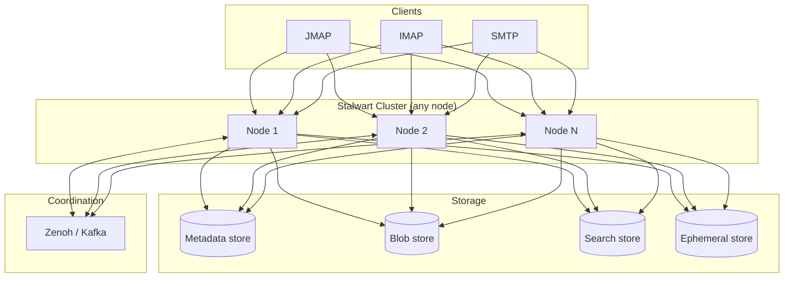

---

## title: "Overview｜概述"

 title\_original: "Overview"
source: "[https://stalw.art/docs/cluster](https://stalw.art/docs/cluster)"
chapter: \["docs","cluster"\]
order: 103
lang: "bilingual"
translated\_by: "google\_v2"
mermaid: "1/1 原始碼"
captured: "2026-10-05T01:05:18.242Z"

 ⬆ 目錄　｜　⬅ 上一篇：Provisioning models｜供應模型　｜　下一篇：Overview｜概述 ➡

# Overview｜概述

> 章節：\\\[docs｜文件\\\]\\\(&lt;000 目錄.md#c-2&gt;\\\) › \\\[cluster｜簇\\\]\\\(&lt;000 目錄.md#c-12&gt;\\\)

Clustering and high availability are central to scalable mail infrastructure. Clustering connects multiple servers so they act as a single system, spreading load and providing redundancy. High availability keeps the service running when individual components fail, minimising downtime.

 叢集和高可用性是可擴展郵件基礎架構的核心。叢集將多個伺服器連接起來，使它們作為單一系統運行，從而分散負載並提供冗餘。高可用性可在單一元件發生故障時保持服務運行，最大限度地減少停機時間。

 Stalwart supports clustering and high availability natively. Deployments can range from a single node to thousands of nodes in a high-demand environment. The server recovers from faults automatically, tolerates hardware and software failures, and keeps operating with minimal manual intervention.

 Stalwart 原生支援叢集和高可用性。部署規模可從單節點到高需求環境下的數千個節點不等。伺服器能夠自動從故障中恢復，容忍硬體和軟體故障，並在極少人工幹預的情況下持續運作。

 Unlike many traditional mail servers, Stalwart does not rely on external directors or proxy servers to route traffic. Any node within a Stalwart cluster can handle IMAP, SMTP, JMAP, or WebDAV requests independently. This simplifies deployment, removes single points of failure, and improves horizontal scalability.

 與許多傳統郵件伺服器不同，Stalwart 不依賴外部路由伺服器或代理伺服器來路由流量。 Stalwart 叢集中的任何節點都可以獨立處理IMAP, SMTP, JMAP或 WebDAV 請求。這簡化了部署，消除了單點故障，並提高了橫向擴展能力。

 In addition to stateless protocol handling, Stalwart supports distributed SMTP queues, so multiple instances process the queue concurrently. Delivery throughput increases and service continues if an individual node becomes unavailable.

 除了支援無狀態協定處理外，Stalwart 還支援分散式SMTP佇列，因此多個執行個體可以並發處理佇列。即使某個節點不可用，也能提高交付吞吐量並保證服務持續運作。

## Coordination｜協調

 Cluster coordination describes how nodes share updates, replicate state, and stay informed about the overall state of the cluster. Coordination synchronises data, keeps the cluster consistent, and reacts to dynamic changes such as node joins, failures, or configuration changes.

 叢集協調描述了節點如何共享更新、複製狀態以及了解叢集的整體狀態。協調機制同步資料、維持叢集一致性，並對節點加入、故障或配置變更等動態變化做出反應。

 Stalwart supports two coordination modes. The default is a lightweight peer-to-peer mode that requires no central coordinator or dedicated server. This mode suits smaller or simpler environments where minimal infrastructure overhead is preferred. For advanced deployments or integration with existing infrastructure, Stalwart can also use third-party systems for coordination, including Apache Kafka, NATS, or Redis. These systems offer message persistence and higher throughput, suiting large-scale or mission-critical deployments.

 Stalwart 支援兩種協調模式。預設模式是輕量級的點對點模式，無需中央協調器或專用伺服器。這種模式適用於規模較小或結構簡單的環境，此類環境對基礎設施開銷的要求較低。對於更高級的部署或與現有基礎設施的集成，Stalwart 還可以使用第三方系統進行協調，例如 Apache Kafka、 NATS或 Redis。這些系統提供訊息持久性和更高的吞吐量，更適合大規模或關鍵任務型部署。

## Orchestration｜管弦樂

 Orchestration is the automated management of containerised applications: deployment, scaling, health monitoring, and recovery. In a Stalwart cluster, orchestration tools manage the lifecycle of each node and keep the infrastructure healthy and responsive under varying loads.

 編排是容器化應用程式的自動化管理：部署、擴展、健康監控和復原。在 Stalwart 叢集中，編排工具可管理每個節點的生命週期，並在不同的負載下保持基礎設施的健康狀態和回應能力。

 Stalwart is compatible with orchestration platforms such as Kubernetes, Apache Mesos, and Docker Swarm. These platforms deploy and scale Stalwart nodes, monitor their health, and restart or replace them on failure. Combined with the built-in clustering and coordination capabilities, orchestration keeps nodes available and functional even in dynamic environments.

 Stalwart 與 Kubernetes、Apache Mesos 和 Docker Swarm 等編排平台相容。這些平台可以部署和擴展 Stalwart 節點，監控其健康狀況，並在發生故障時重新啟動或替換節點。結合內建的叢集和協調功能，即使在動態環境中，編排也能確保節點始終可用且運作正常。

 ---

 ⬆ 目錄　｜　⬅ 上一篇：Provisioning models｜供應模型　｜　下一篇：Overview｜概述 ➡
