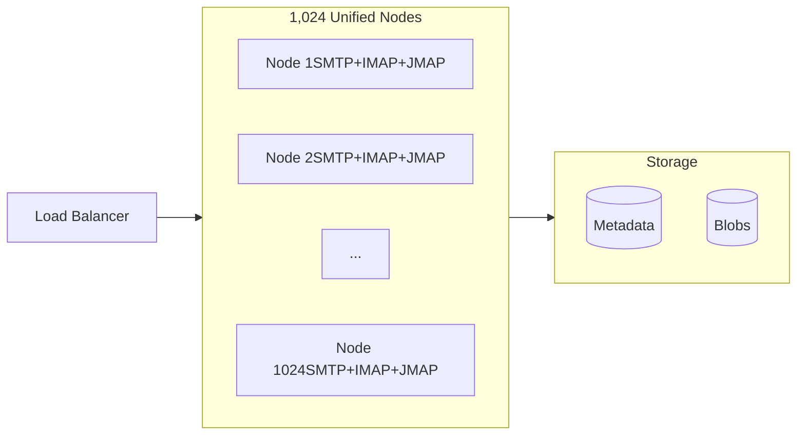
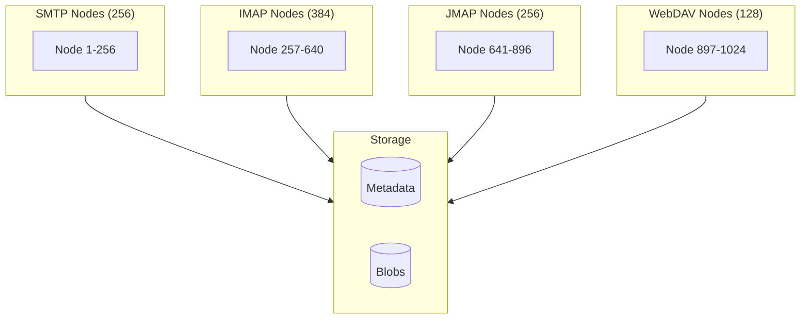
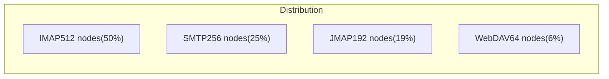
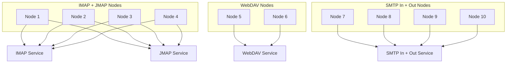
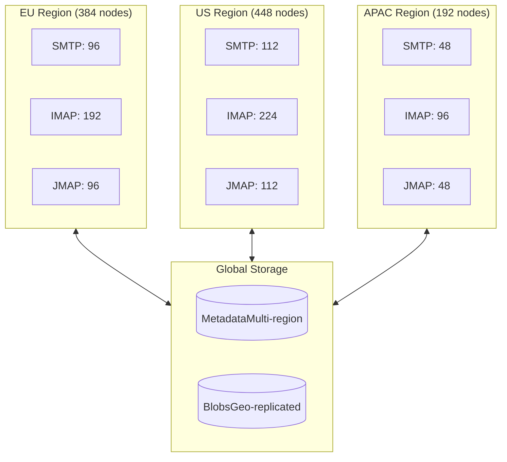

---

## title: "Topology｜拓樸"

 title\_original: "Topology"
source: "[https://stalw.art/docs/cluster/deployment/topology](https://stalw.art/docs/cluster/deployment/topology)"
chapter: \["docs","cluster","deployment"\]
order: 117
lang: "bilingual"
translated\_by: "google\_v2"
mermaid: "5/5 原始碼"
captured: "2026-10-05T01:05:50.241Z"

 ⬆ 目錄　｜　⬅ 上一篇：Storage｜貯存　｜　下一篇：Overview｜概述 ➡

# Topology｜拓樸

> 章節：\\\[docs｜文件\\\]\\\(&lt;000 目錄.md#c-2&gt;\\\) › \\\[cluster｜簇\\\]\\\(&lt;000 目錄.md#c-12&gt;\\\) › \\\[deployment｜部署\\\]\\\(&lt;000 目錄.md#c-15&gt;\\\)

In a Stalwart cluster, administrators control how user-facing services are distributed across nodes. This is distinct from node roles, which assign background maintenance tasks such as store maintenance or certificate renewal. Cluster topology focuses on which protocols \(IMAP, JMAP, WebDAV, SMTP\) each node serves.

 在 Stalwart 叢集中，管理員控制著面向使用者的服務在各個節點上的分佈方式。這與 節點角色不同，後者負責指派後台維護任務，例如儲存維護或憑證續訂。叢集拓撲結構著重於每個節點所支援的協定（ IMAP, JMAP 、WebDAV、 SMTP ）。

 Stalwart allows flexible service distribution: each node can be configured to handle one, several, or all supported protocols. This supports tuning for performance, resource usage, and fault tolerance according to real-world traffic patterns and operational goals.

 Stalwart 支援靈活的服務分配：每個節點都可以配置為處理一種、幾種或所有支援的協定。這支援根據實際流量模式和營運目標，對效能、資源利用率和容錯能力進行調優。

 Listener selection per node is driven by the ClusterRole object \(found in the WebUI under Settings › Cluster › Roles\), through its listeners field \(a ClusterListenerGroup that names specific NetworkListener ids\).

 每個節點的監聽器選擇是由 ClusterRole物件（在 WebUI 的「設定 › 叢集 › 角色」中找到）驅動，透過其 listeners \([https://stalw.art/docs/ref/object/cluster-role#clusterlistenergroup](https://stalw.art/docs/ref/object/cluster-role#clusterlistenergroup)\) 10 月\]\([https://stalw.art/docs/ref/object/network-listener](https://stalw.art/docs/ref/object/network-listener)\) \)。

 The sections below describe common topology strategies used in Stalwart clusters.

 以下各節描述了 Stalwart 叢集中常用的拓樸策略。

## Unified service model｜統一服務模式

 In this approach, every node handles every service: IMAP, JMAP, WebDAV, and SMTP. For example, in a 1024-node deployment, each server is configured identically and can handle any client or protocol.

 在這個方法中，每個節點處理所有服務： IMAP, JMAP 、WebDAV 和SMTP 。例如，在 1024 個節點的部署中，每個伺服器的配置都相同，並且可以處理任何客戶端或協定。

This model suits:

 此款車型適合：

- Simpler management with uniform configuration
採用統一配置，管理更簡便
- Redundancy, since any node can fail without losing service
冗餘設計，因為任何節點發生故障都不會中斷服務。
- Smaller or mid-sized environments where traffic is evenly distributed
交通流量均勻分佈的中小型環境。
The unified model also simplifies load balancing and reduces operational complexity, though it may be less efficient in scenarios where some services see significantly more traffic than others.
 統一模型還可以簡化負載平衡並降低操作複雜性，但在某些服務流量明顯高於其他服務的情況下，其效率可能會降低。

## Service-specific allocation｜特定服務分配

 In this model, nodes are dedicated to specific protocols. For example, a 1024-node cluster might be divided into 256 SMTP nodes, 384 IMAP nodes, 256 JMAP nodes, and 128 WebDAV nodes.

 在這種模型中，節點專用於特定的協定。例如，一個 1024 節點的群集可以分為 256 個SMTP節點、384 個IMAP節點、256 個JMAP節點和 128 個 WebDAV 節點。

This separation of concerns is useful when:

 這種關注點分離的方法在以下情況下很有用：

- Isolating workloads for performance tuning
隔離工作負載以進行效能調優
- Certain services \(for example, SMTP\) need different network access or security policies
某些服務（例如SMTP ）需要不同的網路存取或安全性策略。
- Teams are structured around managing specific services
團隊的組織架構是圍繞著管理特定服務而建構。
Service-specific allocation allows more granular resource planning, at the cost of more sophisticated monitoring and load balancing.
 針對特定服務的資源分配可以實現更精細的資源規劃，但代價是需要更複雜的監控和負載平衡。

## Weighted allocation based on load｜基於負載的加權分配

 Clusters can also be sized according to expected usage patterns. For instance, if IMAP usage is significantly heavier than JMAP or WebDAV, the topology could look like this:

 集群的大小也可以根據預期的使用模式進行調整。例如，如果IMAP使用量明顯高於JMAP或WebDAV，則拓樸結構可能如下所示：

| Protocol 協定 | Nodes 節點 | Rationale 原理 |
| --- | --- | --- |
| IMAP | 512 | Long-lived connections, high memory 持久連接，高記憶力 |
| SMTP | 256 | Burst traffic, queue processing 突發流量，佇列處理 |
| JMAP | 192 | API-heavy, mobile clients API - 重量級、行動客戶端 |
| WebDAV | 64 | Calendar and contacts, lower volume 日曆與聯絡人，音量較低 |

This model balances redundancy and efficiency, allocating more resources to higher-demand services while still covering less-used protocols.

 該模型兼顧冗餘性和效率，將更多資源分配給需求更高的服務，同時仍涵蓋使用較少的協定。

 It suits:

 它很合適：

- Enterprise environments with known usage trends
具有已知使用趨勢的企業環境
- Scenarios where IMAP or SMTP dominate traffic
IMAP或SMTP主導流量的場景
- Clusters designed to scale incrementally
旨在逐步擴展的集群
## Protocol pairing model｜協議配對模型

 Some organisations prefer to group complementary protocols. A common configuration looks like:

 有些組織傾向於將互補的協議歸為一組。常見的配置方式如下：

- 40 percent of the nodes for IMAP and JMAP
IMAP和JMAP的節點中有 40%
- 20 percent of the nodes for WebDAV
20% 的節點用於 WebDAV
- 40 percent of the nodes for inbound and outbound SMTP
入站和出站節點的 40% SMTP

This model offers:

 此型號提供：

- Reduced configuration duplication
減少配置重複
- Logical pairing of user-facing services \(for example, IMAP and JMAP both serve mail clients\)
面向使用者的服務的邏輯配對（例如， IMAP和JMAP都為郵件客戶端提供服務）
- Efficient use of resources while still allowing role separation
既要有效率地利用資源，又要允許角色分離
Pairing services also simplifies routing and firewall policies, especially when grouped by access pattern \(client-facing versus mail-routing\).
 配對服務還可以簡化路由和防火牆策略，尤其是在按存取模式（面向客戶端與郵件路由）分組時。

## Geographically distributed topology｜地理分佈拓撲

 In larger or multi-site deployments, nodes may be distributed across data centres or geographic regions, with services colocated by regional demand:

 在規模較大或多站點部署中，節點可以分佈在不同的資料中心或地理區域，服務根據區域需求進行集中部署：

- Region A: 384 nodes \(IMAP, SMTP inbound\)
區域 A：384 個節點（ IMAP, SMTP入站）
- Region B: 448 nodes \(IMAP, JMAP, SMTP outbound\)
B 區：448 個節點（ IMAP, JMAP, SMTP出站）
- Region C: 192 nodes \(WebDAV, JMAP, SMTP\)
C 區：192 個節點（WebDAV， JMAP, SMTP ）

This approach improves:

 這種方法可以改進：

- Latency for users in different regions
不同地區使用者的延遲
- Resilience to regional outages
應對區域性停電的復原能力
- Load isolation by physical location
透過實體位置進行負載隔離
Geographically distributed clusters typically rely on global load balancers, DNS-based routing, or geo-aware proxies to direct traffic efficiently.
 地理分佈的叢集通常依靠全球負載平衡器、基於DNS的路由或地理感知代理來有效地引導流量。

## Choosing the right topology｜選擇合適的拓撲結構

 There is no one-size-fits-all topology. The best choice depends on organisational size, usage patterns, and operational preferences. One of the strengths of the Stalwart architecture is that topologies are flexible and can be adjusted over time. A simple unified model can be a starting point, with a transition to a more specialised layout as needs evolve.

 沒有一種拓樸結構能夠適用於所有情況。最佳選擇取決於組織規模、使用模式和維運偏好。 Stalwart 架構的優勢之一在於其拓撲結構的靈活性，可以隨時間進行調整。一個簡單的統一模型可以作為起點，隨著需求的演變，可以過渡到更專業的佈局。

 Approaches can also be mixed and matched, running unified nodes alongside dedicated ones, or shifting services dynamically as demand grows.

 也可以將各種方法混合搭配使用，例如在專用節點和統一節點之間運行，或隨著需求的成長動態轉移服務。

 ---

 ⬆ 目錄　｜　⬅ 上一篇：Storage｜貯存　｜　下一篇：Overview｜概述 ➡
